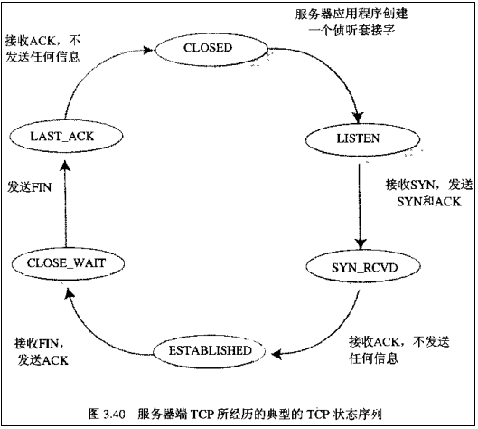

## socket:

1. socket是网络进程之间的通讯方式，是对TCP/IP协议的封装。socket并不是像HTTP、TCP、IP一样的协议，而是一组调用接口（API）。通过socket，可以使用TCP/IP协议，即可以在网络上传输数据。
2. http是应用层协议，web开发中最常见的协议。当我们在浏览器输入一个网址，比如<http://www.google.com>时:
    * 浏览器首先会去查看本地hosts文件，通过域名（google.com）获取其对应的IP地址，如果本地没有找到，则继续向上层请求DNS服务器，DNS服务器就像一个树结构，一层一层的向上递进查找。
    * 获取IP地址之后，浏览器会根据IP与默认端口80，通过TCP协议三次握手与服务器建立socket连接。
    * 在linux下，一切皆文件。系统将每一个socket连接也抽象成一个文件，客户端与服务器建立连接之后，各自在本地进程中维护一个文件，然后可以向自己文件写入内容供对方读取或者读取对方内容，通讯结束时关闭文件。

## TCP三次握手、四次挥手

* **TCP连接到断开过程：**

    <div align=center></div>

    * 三次握手：
    
        第一次握手：客户端尝试连接服务器，向服务器发送syn包（同步序列编号Synchronize Sequence Numbers），syn=j，客户端进入SYN_SEND状态等待服务器确认；

        第二次握手：服务器接收客户端syn包并确认（ack=j+1），同时向客户端发送一个SYN包（syn=k），即SYN+ACK包，此时服务器进入SYN_RECV状态；此时，内核将连接（socket）放入SYN QUEUE，即 ***未完成队列*** ，该队列大小由/proc/sys/net/ipv4/tcp_max_syn_backlog设定；

        第三次握手：客户端收到服务器的SYN+ACK包，向服务器发送确认包ACK(ack=k+1），此包发送完毕，客户端和服务器进入ESTABLISHED状态，完成三次握手。此时，内核将连接（socket）移到ACCEPT QUEUE，即 ***已完成队列*** ，队列大小为socket listen()函数传入的backlog参数与/proc/sys/net/core/somaxconn决定，取二者最小值。服务器程序调用accept函数后，该连接（socket）被内核从已完成队列移除，并交由服务器程序控制。

        ***注意*** : TCP三次握手在应用程序调用accept函数之前由内核完成。调用accept只是获取已经完成的连接。

    * 四次挥手
    
        第一次挥手：主机1（可以使客户端，也可以是服务器端），设置Sequence Number和Acknowledgment Number，向主机2发送一个FIN报文段；此时，主机1进入FIN_WAIT_1状态；这表示主机1没有数据要发送给主机2了；

        第二次挥手：主机2收到了主机1发送的FIN报文段，向主机1回一个ACK报文段，Acknowledgment Number为Sequence Number加1；主机1进入FIN_WAIT_2状态；主机2告诉主机1，我“同意”你的关闭请求；
        
        第三次挥手：主机2向主机1发送FIN报文段，请求关闭连接，同时主机2进入LAST_ACK状态；
        
        第四次挥手：主机1收到主机2发送的FIN报文段，向主机2发送ACK报文段，然后主机1进入TIME_WAIT状态；主机2收到主机1的ACK报文段以后，就关闭连接；此时，主机1等待2MSL后依然没有收到回复，则证明Server端已正常关闭，那好，主机1也可以关闭连接了

* **client状态过程：**
   
   <div align=center></div>

* **server状态过程：**
   
   <div align=center></div>

## socket实例

* server.py

   ```python
    import socket
    import StringIO
    
    HOST = "127.0.0.1"
    PORT = 3267
    
    # 创建一个IPV4且基于TCP协议的socket对象
    server = socket.socket(socket.AF_INET, socket.SOCK_STREAM)
    # 绑定监听端口
    server.bind((HOST, PORT))
    # 开始监听端口，并且等待连接的最大数量为5
    server.listen(5)

    print "waiting for connection..."

    while True:
        # 接受连接（此方法阻塞）
        conn, addr = server.accept()
        print "Connected by ", addr
        
        buffer = StringIO.StringIO()
        while True:
            # 每次最多读取1k数据
            data = conn.recv(1024)
            if data:
                print "receive client data: ", data
                buffer.write(data)
                conn.sendall("Hello, {}".format(data))
            else: 
                break
            
        print "receive client ALL datas: ", buffer.getvalue()
        buffer.close()
        conn.close()
        print 'Connection from %s:%s closed.' % addr
   ```

* client.py
   
   ```python
    import socket
    
    HOST = "127.0.0.1"
    PORT = 3267

    # 创建一个IPV4且基于TCP协议的socket对象
    client = socket.socket(socket.AF_INET, socket.SOCK_STREAM)
    # 建立连接
    client.connect((HOST, PORT))

    while True:
        try:
            # 获取用户控制台输入
            data = raw_input("please input something: ")
        except:
            # 关闭客户端连接
            client.close()
            break

        client.send(data)
        result = client.recv(1024)
        print "client result: ", result

   ```

* 运行过程：
    1. 运行server.py文件，系统进程会启动一个本地socket，该socket会一直循环等待客户端socket的连接。
    2. 当我们运行client.py文件后，客户端会与服务端建立连接。此时，客户端文件会读取用户在控制台的输入数据，然后发送给服务器。

* 问题：
    当多开一个控制台再次运行client.py时,此时是无法与服务器建立连接的。因为该程序是单线程的，也就是同一时间服务器只能被一个客户端连接。

* 传统解决方法：
    传统解决方式就是多线程，一个客户端连接开启一个线程去处理。修改后的server.py如下：

   ```python
    import socket
    import StringIO
    import threading
    
    HOST = "127.0.0.1"
    PORT = 3267
    
    # 创建一个IPV4且基于TCP协议的socket对象
    server = socket.socket(socket.AF_INET, socket.SOCK_STREAM)
    # 绑定监听端口
    server.bind((HOST, PORT))
    # 开始监听端口，并且等待连接的最大数量为5
    server.listen(5)

    print "waiting for connection..."

    def handle_conn(conn, addr):
        buffer = StringIO.StringIO()
        while True:
            # 每次最多读取1k数据
            data = conn.recv(1024)
            if data:
                print "receive client data: ", data
                buffer.write(data)
                conn.sendall("Hello, {}".format(data))
            else: 
                break
            
        print "receive client ALL datas: ", buffer.getvalue()
        buffer.close()
        conn.close()
        print 'Connection from %s:%s closed.' % addr

    while True:
        # 接受连接（此方法阻塞）
        conn, addr = server.accept()
        print "Connected by ", addr
        
        threading.Thread(target=handle_conn, args=(conn, addr)).start()

   ```

* 优化解决方法：
    传统解决方法显然不现实，无法承受高并发、高访问量，线程对资源的消耗太大。为解决此问题，引入新概念：[IO多路复用](./io_multiplexing.md)（Linux下select/poll/epoll），即事件驱动，所谓的Reactor模式。它实现了单线程连接多客户端。使用epoll实现server.py：

   ```python
    import socket
    import StringIO
    import select
    
    HOST = "127.0.0.1"
    PORT = 3267
    
    # 创建一个IPV4且基于TCP协议的socket对象
    server = socket.socket(socket.AF_INET, socket.SOCK_STREAM)
    # 绑定监听端口
    server.bind((HOST, PORT))
    # 开始监听端口，并且等待连接的最大数量为5
    server.listen(5)
    # 设置非阻塞
    server.setblocking(0)
    
    # 获取epoll对象
    epoll = select.epoll()
    # 向epoll中注册服务器socket描述符，监听读事件
    epoll.register(server.fileno(), select.EPOLLIN)

    print "waiting for connection..."
    
    connections = {}
    requests = {}
    responses = {}

    while True:
        # 当监听的socket文件描述符发生改变则会以列表的形式主动报告给用户进程（阻塞）
        events = epoll.poll()
        # 循环发生改变的socket，返回的每个对象都是一个元组：(socket描述符, 监听的事件)
        for fileno, event in events:
            # 判断是否为服务器socket描述符，如果是则为第一个连接
            if fileno == server.fileno():
                # 接受连接（此方法阻塞），每一次与客户端建立连接都会创建一个socket，即下面的conn
                conn, addr = server.accept()
                print "Connected by ", addr
                
                conn_fd = conn.fileno()
                # 设置socket连接为非阻塞
                conn.setblocking(0)
                # 将socket连接注册到epoll，监听读事件
                epoll.register(conn_fd, select.EPOLLIN)
                # 保存所有连接
                connections[conn_fd] = (conn, addr)
            # 判断是否为断开事件
            elif event & select.EPOLLHUP:
                # 解除epoll对socket的监听
                epoll.unregister(fileno)
                # 关闭socket连接
                connections[fileno][0].close()
                del connections[fileno]
                print 'Connection from %s:%s closed.' % connections[fileno][1]
            # 判断是否为读事件
            elif event & select.EPOLLIN:
                conn = connections[fileno][0]
                buffer = StringIO.StringIO()
                while True:
                    try:
                        # 每次最多读取1k数据
                        data = conn.recv(1024)
                    except socket.error, e:
                        # import traceback
                        # print traceback.format_exc()
                        break

                    if data:
                        print "receive client data: ", data
                        buffer.write(data)
                        conn.sendall("Hello, {}".format(data))
                    else: 
                        break
                print "receive client ALL datas: ", buffer.getvalue()
                
                requests[fileno] = buffer.getvalue().strip()
                epoll.modify(fileno, select.EPOLLOUT)
                buffer.close()
            # 判断是否为写事件
            elif event & select.EPOLLOUT:
                connections[fileno].send(requests[fileno])
                # 写事件完成之后将该socket从监听写事件改为监听读事件
                epoll.modify(fileno, select.EPOLLIN)

   ```


