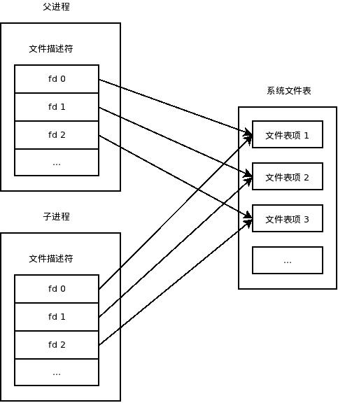

## tornado对posix的实现解析

tornado.platform.posix，Posix平台特定功能的实现。Posix平台指“可移植操作系统接口”（Portable Operation System Interface），最后的x代表类Unix系统。该文件主要是对Linux系统相关API的实现，Windows NT系列实现为tornado.platform.windows、tornado.platform.common。

* close-on-exec标志详解

当我们fork子进程时，子进程以写时复制（COW，Copy-On-Write）方式获得父进程的数据空间、堆和栈副本，这其中也包括文件描述符。刚刚fork成功时，父子进程中相同的文件描述符指向系统文件表中的同一项（这也意味着他们共享同一文件偏移量）。

<div align=center></div>

接着，在子进程中我们会exec另一个程序，此时会用全新的程序替换子进程的正文，数据，堆和栈等。此时保存文件描述符的变量当然也不存在了，我们就无法关闭无用的文件描述符了。所以通常我们会fork子进程后在子进程中直接执行close关掉无用的文件描述符，然后再执行exec。

但是在复杂系统中，有时我们fork子进程时已经不知道打开了多少个文件描述符（包括socket句柄等），这此时进行逐一清理确实有很大难度。我们期望的是能在fork子进程前打开某个文件句柄时就指定好：“这个句柄我在fork子进程后执行exec时就关闭”。其实是有这样的方法的：即所谓的 close-on-exec。设置close-on-exec为FD_CLOEXEC，即1（系统默认为0），这样，当fork子进程后，仍然可以使用fd。但执行exec后系统就会字段关闭子进程中的fd了，即不能再在该文件中读写数据了。

* tornado.platform.posix

   ```python
    def set_close_exec(fd):
        # 取得与文件描述符fd联合的close-on-exec标志，类似FD_CLOEXEC。
        # 如果返回值和FD_CLOEXEC进行与运算结果是0的话，文件保持交叉式访问exec()，
        # 否则如果通过exec运行的话，文件将被关闭
        flags = fcntl.fcntl(fd, fcntl.F_GETFD)
        # 设置close-on-exec标志，该标志以参数arg的FD_CLOEXEC位决定，
        # 很多现存的涉及文件描述符标志的程序并不使用常数 FD_CLOEXEC，
        # 而是将此标志设置为0(系统默认，在exec时不关闭)或1(在exec时关闭) 
        fcntl.fcntl(fd, fcntl.F_SETFD, flags | fcntl.FD_CLOEXEC)

    def _set_nonblocking(fd):
        # 取得fd的文件状态标志
        flags = fcntl.fcntl(fd, fcntl.F_GETFL)
        # 设置fd描述符状态标志为非阻塞，如果read(1024)调用没有可读取的数据，
        # 或者如果write(1024)操作时写缓存区已满，
        # 则read或write调用将返回-1和EAGAIN错误，而不会被阻塞
        fcntl.fcntl(fd, fcntl.F_SETFL, flags | os.O_NONBLOCK)
    
    # 唤醒者（另一线程）
    class Waker(interface.Waker):
        def __init__(self):
            r, w = os.pipe()
            _set_nonblocking(r)
            _set_nonblocking(w)
            set_close_exec(r)
            set_close_exec(w)
            self.reader = os.fdopen(r, "rb", 0)
            self.writer = os.fdopen(w, "wb", 0)

        def fileno(self):
            return self.reader.fileno()

        def write_fileno(self):
            return self.writer.fileno()

        def wake(self):
            try:
                self.writer.write(b"x")
            except (IOError, ValueError):
                pass

        def consume(self):
            try:
                while True:
                    result = self.reader.read()
                    if not result:
                        break
            except IOError:
                pass

        def close(self):
            self.reader.close()
            common.try_close(self.writer)
   ```

通过上面对close-on-exec标志的详解，再解读tornado.platform.posix就容易理解了。set_close_exec(fd)就是为了设置close-on-exec标志位为1；_set_nonblocking(fd)为了设置IO读写为非阻塞模式。

类Waker可以解释为唤醒者。它继承至tornado.platform.interface.Waker，是一个类似socket（pipe管道）的对象，可以从”select.select()“或“epoll.poll()”等类似函数唤醒另一个线程。tornado.ioloop.IOLoop将会把Waker的读文件描述符添加到”select“（或”epoll“或”kqueue“）中。

由于epoll.poll()（select.select()）函数是阻塞的，即当没有读写事件发生时会休眠，而当另一个线程想要唤醒IOLoop时，它会调用Waker.wake()，向pipe中写入数据，此时，已经被注册到epoll中的读管道pipe会被触发，从而epoll.poll()函数返回，即所谓唤醒了IOLoop。

IOLoop一旦醒来，它将调用Waker.consume()回调函数，以进行必要的每次唤醒清理，即将为唤醒IOLoop而写入的数据读完。当“IOLoop”关闭时，它也关闭了它的waker。